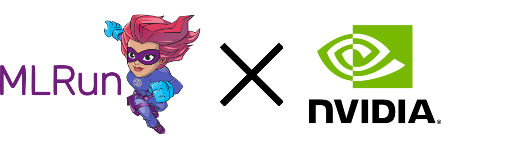

# **Banking AI Bot** - Multi-Agent System with NVIDIA NIMs

This demo shows how to deploy NVIDIA NIM (NVIDIA Inference Microservices) and build an AI application: a **Multi-Agent Banking Bot**! We'll deploy [**NVIDIA's NIM**](https://developer.nvidia.com/nim) microservices and cover how easy it is to take them to production with monitoring, scaling and MLOps best practices. MLRun handles all the complexity!

The demo contains a single [notebook](./mlrun-nim-demo.ipynb) covering two main stages:

* **Model Serving & Monitoring** - Deploy a NIM, add MLRun's LLM Gateway for modularity and monitoring capabilities
* **Application Pipeline** - Build a multi-agent banking chatbot using MLRun's GenAI Factory components

We will use:
* [**NVIDIA NIM**](https://developer.nvidia.com/nim) - for GPU-accelerated model serving
* [**MLRun**](https://www.mlrun.org/) - as the orchestrator to operationalize it all
* [**LangChain**](https://www.langchain.com/) - as the main framework for building the AI logic

> This demo was showcased in Iguazio's Webinar [Deploying GenAI in Production with NVIDIA NIM and MLRun](https://www.iguazio.com/sessions/deploying-gen-ai-in-production-with-nvidia-nim-mlrun/). 
>
> Check out the webinar here:
> 
> 
